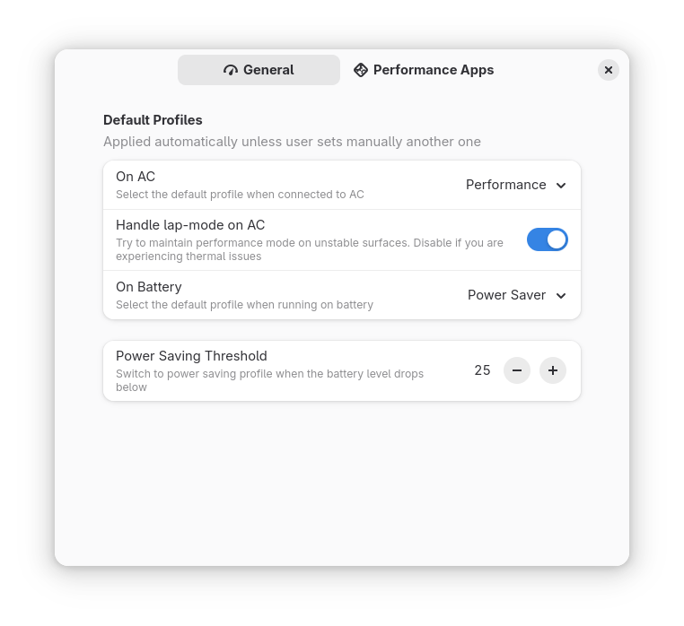

# Auto Power Profile

Extensão para GNOME Shell que alterna automaticamente entre perfis de energia conforme o status da fonte de alimentação e nível da bateria.

Este projeto é um fork mantido por [andrecesarvieira](https://github.com/andrecesarvieira), baseado no trabalho original de [dmy3k](https://github.com/dmy3k/auto-power-profile).

## Compatibilidade

- GNOME Shell: 45, 46, 47, 48
- Linux: Requer suporte ao `powerprofilesctl` ou `tuned-ppd` (Fedora >= 40)

## Instalação

### Dependências

- [`powerprofilesctl`](https://gitlab.freedesktop.org/upower/power-profiles-daemon) (presente na maioria das distros GNOME)
- Ou `tuned-ppd` (Fedora >= 40)

### Loja de Extensões GNOME

Disponível na [GNOME Extensions](https://extensions.gnome.org/extension/6583/auto-power-profile/).

### Instalação manual (desenvolvimento)

```bash
# Clone o repositório do fork
git clone https://github.com/andrecesarvieira/auto-power-profile.git
cd auto-power-profile

# Compile schemas
glib-compile-schemas schemas/

# Empacote a extensão
gnome-extensions pack --podir=po --extra-source=ui --extra-source=lib

# Instale e ative
gnome-extensions install --force auto-power-profile@andrecesarvieira.github.io.shell-extension.zip
gnome-extensions enable auto-power-profile@andrecesarvieira.github.io
```

A extensão aparecerá na lista e será ativada após reiniciar a sessão.

## Configuração

O painel de configurações permite:

- Definir perfis padrão para energia e bateria
- Ajustar limite para economia de energia
- Ativar/desativar modo "colo" (lap-mode)
- Selecionar aplicativos que ativam perfil de desempenho



## Tradução

O projeto suporta múltiplos idiomas. Para contribuir com traduções:

1. Gere o arquivo `.pot` após adicionar novas strings:
   ```bash
   xgettext \
     --from-code=UTF-8 \
     --package-name="Auto Power Profile" \
     --output="po/auto-power-profile.pot" \
     *.js \
     ui/*.ui
   ```
2. Crie ou edite arquivos `.po` (exemplo: `cp po/auto-power-profile.pot po/pt_BR.po`).
3. Edite com [Poedit](https://poedit.net/) ou similar.
4. Envie um Pull Request.

## Contribuição

Contribuições são bem-vindas! Abra issues ou envie PRs.

## Créditos

Baseado no trabalho de [eliapasquali/power-profile-switcher](https://github.com/eliapasquali/power-profile-switcher).
