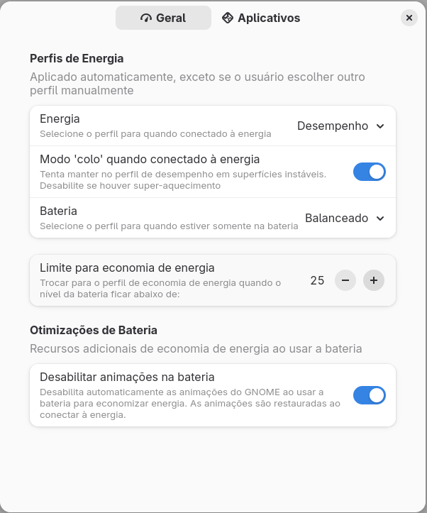
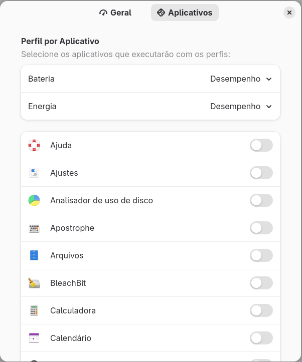

# Auto Power Profile

Extensão GNOME Shell para alternância automática de perfis de energia com controle de animações na bateria.

> 🔋 **Economia inteligente**: Alterna perfis automaticamente e desabilita animações na bateria

**Compatibilidade**: GNOME Shell 45-49 | **Versão**: 2.0.0

## 🚀 Instalação

```bash
curl -fsSL https://raw.githubusercontent.com/andrecesarvieira/auto-power-profile/main/install.sh | bash
```

**Dependência**: `sudo apt install power-profiles-daemon` (Ubuntu/Debian) ou `sudo dnf install power-profiles-daemon` (Fedora)

## ⚡ Funcionalidades

- **🔄 Alternância automática**: Perfis personalizáveis para energia e bateria
- **🎬 Controle de animações**: Desabilita animações automaticamente na bateria
- **⚙️ Limite configurável**: Definir % da bateria para modo economia
- **🎯 Apps específicos**: Perfis para aplicativos de alta performance

## ⚙️ Configuração

Configure em: **Configurações > Extensões > Auto Power Profile**

|  |  |
|:--:|:--:|
| Perfis e limites de bateria | Aplicativos específicos |

## 🌍 Traduções

Suporte a **6 idiomas**: 🇧🇷 Português | 🇺🇸 English | 🇪🇸 Español | 🇫🇷 Français | 🇸🇪 Svenska | 🇺🇦 Українська

## 🔧 Resolução de Problemas

- **Instalação falha**: Consulte o [Guia de Troubleshooting](./TROUBLESHOOTING.md)
- **Extensão não carrega**: Instale `power-profiles-daemon` e reinicie a sessão
- **Perfis não alternam**: Verifique com `powerprofilesctl list`
- **Animações não desabilitam**: Ative a opção nas configurações da extensão

**Suporte**: [Issues](https://github.com/andrecesarvieira/auto-power-profile/issues) | [Discussões](https://github.com/andrecesarvieira/auto-power-profile/discussions)

---

## � Licença

[GPL v3.0](LICENSE) | Mantido por [andrecesarvieira](https://github.com/andrecesarvieira) | Fork de [dmy3k/auto-power-profile](https://github.com/dmy3k/auto-power-profile)
